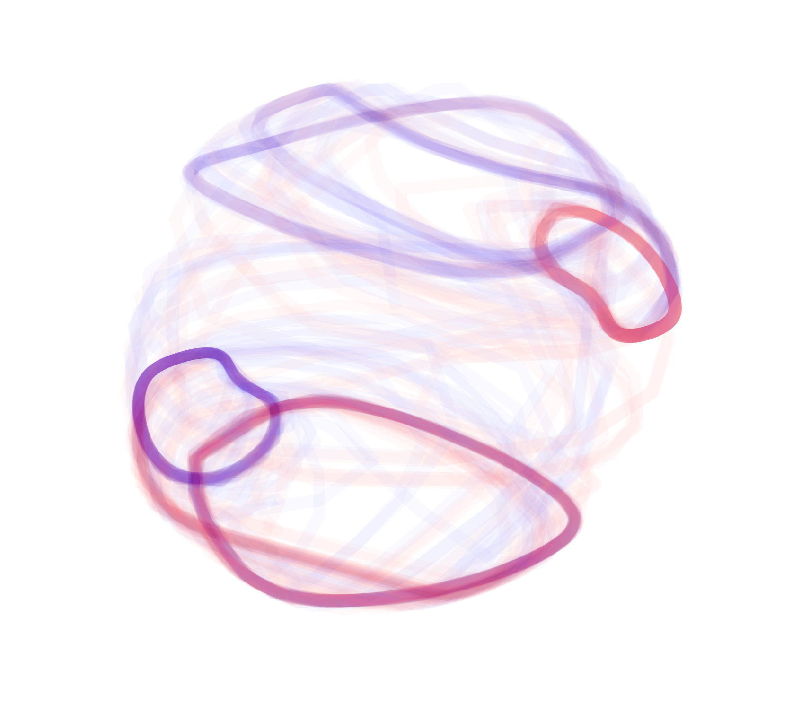
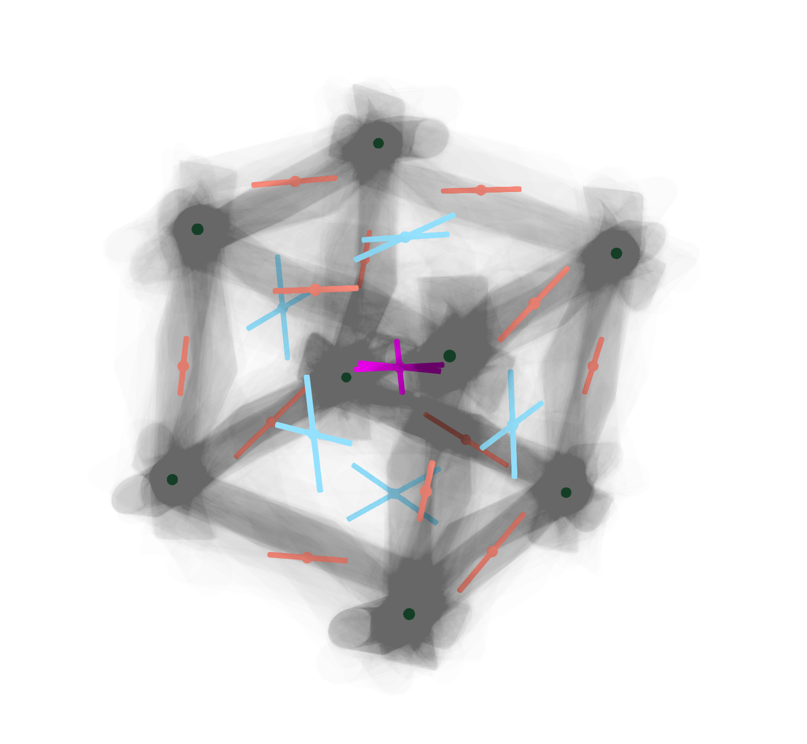

# pyrnn
RNNs in pytorch: training, analysis and visualization. 

This code represents my efforts to explore and understands RNNs, mostly from a dynamical systems perspective. 
It's made freely available in the hope that it might be helpful for others interested in the same topics, but with no guarantee about anything that the software does.

## Installation
```
pip install git+https://github.com/FedeClaudi/pyrnn.git
```

or clone this repository to also have the examples scripts.


# Features
## RNN model design
`pyrnn` currently implements two `RNN` classes and provides a flexible framework for developing new ones. 
All `RNN` classes can subclass `pyrnn._rnn.RNNBase` as the main RNN class. 
`RNNBase` takes care of many generally useful tasks like implementing constraints on recurrent weights, training the network, loading/saving trained networks etc.

The hidden state of the main `RNN` class is update with:

$$
    h(t) = \tanh(W_{in} X + W_{rec} h(t-1) + b_{rec})
$$

and the output is a linear combination of the hidden state
$$
    o(t) = W_{out} h(t)
$$


where $W_{rec}$ and $b_{rec}$ are the recurrent weights and bias for the recurrent network and are the only trainable parameters (though the other can be made trainable if necessary).
An additional bias term for the input and output layers can be added

### recurrent weights: biological constrains.
To use RNNs in neuroscientific research, it may be interesting to implement constraints on the recurrent weights matrix to replicate some of what is observed in biological neural networks. 

Available constraints include: 
    - autopses removal: removing elements from the main diagonal of $W_{rec}$ to remove synapses of neurons onto themselves
    - dale ratio: specify the ratio of excitatory to inhibitory units.

Not yet implemented but in the future a connectivity structure (e.g. to have two independent subnetworks) will be available. 

### RNN training
`RNN` classes that subclass `RNNBase` will have a `fit` method that can be used to train the RNN.
`fit` takes a pytorch dataset as input and uses it to train the network using Adam optimizer with a MSE loss and an optional learning rate scheduler. `fit` includes several parameters to fine tune the training.

After training, `RNN.save` can be used to save the network's weights for re-loading in the future (with `RNN.load`).


## Example tasks
Example tasks are provide to try training RNNs and performing the available analyses on trained networks. 
These include

- **3 bit flip flop** from [1]: an RNN is given three independent inputs which take random values from the set {-1, 0, 1}. The network has 3 outputs, each corresponding to an input. The network's output need to reflect the last non-zero input from each of the 3 input, thus the network has to remember 3 independent variable that can each be in one of two states
- **integrator** The network receives 1 input that at each time point is drawn from {-.3, -.2, -.1, .1, .2, .3}, this represents an indication of 'angular speed'. The network's goal is to integrate the speed signal and output the current heading angle: crucially this implies dealing with a periodic variable. The network's output has to be in range (-1, 1) which correspondes to (-pi, pi) angles.

## Dynamics analysis
**Fixed points analysis**: analyse the networks dynamics to find (almost) fixed points [1], [2].
This is done by taking the trajectory of hidden state of a network as it predicted an input sequence, initialising the network's state at random locations along this trajctory (with nosie) and stepping the network under constant inputs (generally 0s).
Then move the network in the direction of decreasing speed (defined as the norm of the difference between the hidden state at two consecutive steps). 
If the network converges to a state with very slow dynamics that's conisidered a fixed point.

Fixed points can be analysed to asses their stability: the jacobian of the Network's dynamics at a fixed point is computed, and the eigenvalue decomposition of the Jacobia is used to identify the number of unstable modes and distinguish between stable and unstable fixed points.

The topoligy of the dynamics is identified by creating a directed graph showing with what probability the dinamics go form one fixed point to an other [3]. 
This is done by initializing the network at each fixed point (with noise and repeating several times) and letting the dynamics evolve under a constant input to see at which fixed point the dynamics end up. 
This information is then used to construct the directed graph.



Dynamics from two trials in the integrator task. What you're seeing is the 3d render of the first 3 PC components of the hidden state dynamics, color coded by the input signal (blue = -3, red=+3).
The main circle corresponds to the dynamics for the speed signalled by the input at the start of the trial, the smaller circle is occupied when the speed signal is changed. 


Dynamics and fixed points of the hidden state of a RNN trained on the 3bit flifp flop memory task. 
The gray trace shows the trajectory of the hidden state in PCA space, sphere indicate fixed points colorcoded by the number of unstable modes (shown) of each fixed pont.

## Visualization
`pyrnn` provides method for creating plots of activity as well as 3d interactive renderings (using `vedo` [4]).
The renderings in particular can be used to visualise the results of the Dynamics Analysis.


# References
[1] Sussillo, David, and Omri Barak. 2013. “Opening the Black Box: Low-Dimensional Dynamics in High-Dimensional Recurrent Neural Networks.” Neural Computation 25 (3): 626–49.
[2] Golub, Matthew D., and David Sussillo. 2018. “FixedPointFinder: A Tensorflow Toolbox for Identifying and Characterizing Fixed Points in Recurrent Neural Networks.” Journal of Open Source Software 3 (31): 1003.
[3] Maheswaranathan, Niru, Alex H. Williams, Matthew D. Golub, Surya Ganguli, and David Sussillo. 2019. “Universality and Individuality in Neural Dynamics across Large Populations of Recurrent Networks.” Advances in Neural Information Processing Systems 2019 (December): 15629–41.
[4] M. Musy et al., "vedo, a python module for scientific visualization and analysis of 3D objects and point clouds based on VTK (Visualization Toolkit)", Zenodo, 10 February 2019, doi: 10.5281/zenodo.2561402.

